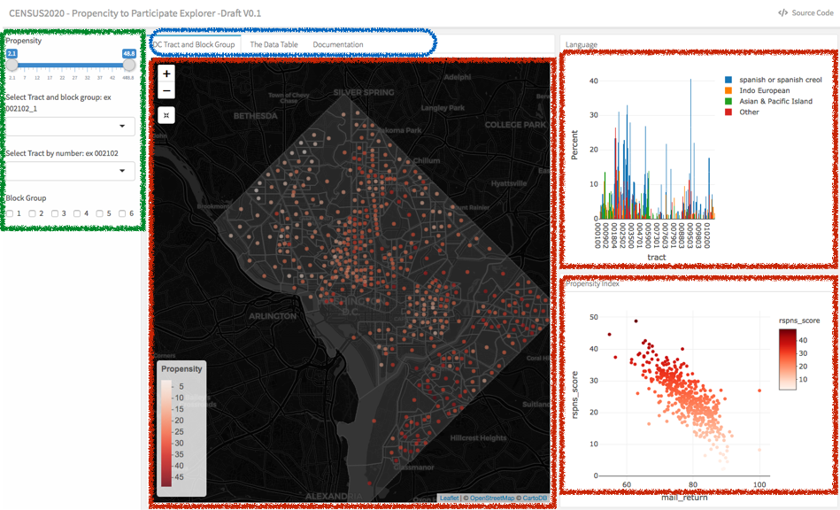

```{r setup, include=FALSE}
library(flexdashboard)
library(crosstalk)
library(leaflet)
library(leaflet.extras)
library(plotly)
library(DT)
library(sf)
library(dplyr)
library(tidyr)
library(tidyselect)
library(ggplot2)

df_1 <- readRDS("data/df_1.rds")
df_fin <- readRDS("data/df_fin.rds")
df_fin_2 <- df_fin %>% 
             mutate(tract_blockgrp = paste0(tract,"_",block_group)) %>% 
             select(tract_blockgrp, everything()) 


#options(persistent = TRUE)

sd1 <- SharedData$new(df_1)
#sd2 <- SharedData$new(df_fin %>% select(-popup_text))
sd2 <- SharedData$new(df_fin_2 %>% select(-popup_text))

```

Inputs {.sidebar}
-----------------------------------------------------------------------


```{r selectors}
filter_slider("rspns_score", "Propensity", sd2, ~rspns_score,  step = 1)
filter_select("tract_blockgrp", "Select Tract and block group: ex 002102_1", sd2, ~tract_blockgrp, multiple = FALSE)
filter_select("tarct", "Select Tract by number: ex 002102", sd2, ~tract, multiple = FALSE)#, selected = "000100")
filter_checkbox("block_group", "Block Group", sd2, ~block_group, inline = TRUE) 
```
  
Column {.tabset .tabset-fade}
-------------------------------------
 
### DC Tract and Block Group 

```{r LeafLetMap_1}

pal <- colorNumeric(palette = "Reds",
                    domain = df_fin$rspns_score)

dc_leaf <- leaflet(df_fin) %>%
               addProviderTiles("CartoDB.DarkMatter") %>%
               setView(lng = -77.03687, lat = 38.90717, zoom = 12) %>%
               addResetMapButton() %>%
              addPolylines(data = sd1 ,
                         stroke = TRUE, 
                   smoothFactor = 1,
                         weight = 1, 
                          color = "gray"
                           ) %>% 
               addPolygons(data = sd1,
                          color = "#444444", 
                      dashArray = "3",
                         weight = 2,   #line thickness 
                   smoothFactor = 0.5,
                        opacity = 0.5,
                    fillOpacity = 0.5,
               highlightOptions = highlightOptions(color = "green", weight = 5,bringToFront = TRUE), 
                          popup = df_fin$popup_text,
                          label = ~trct_blk
                           ) %>% 
              addLegend( position = "bottomleft", 
                              pal = pal, 
                           values = ~rspns_score,
                            title = "Propensity",
                          opacity = .8
                              ) %>%
              addCircleMarkers(data = sd2,
                             radius = .001, 
                              color = ~pal(df_1$rspns_score),
                              group = "BlockGroup"
                               ) %>%
            addMiniMap(tiles = providers$Esri.WorldStreetMap,
               toggleDisplay = T)       
dc_leaf
```

### The Data Table 
```{r dataTable_1}
datatable(sd2, rownames = TRUE, extensions = 'Scroller', options = list(
          scrollY = 200,
          scroller = TRUE
          ))
```

### Documentation
<h3>App description </h3>
* a  
* b  
* c  
{width=75%}  

<h3>Feature Selectoin Consideration </h3>
- a  
- b  
- c 

<h3>Control Buttons </h3>  
- a  
- b  
- c    
<h3>Data Dictonary* </h3>   
- a  
- b  
- c  

Column {data-width=400}
-------------------------------------
   
### Language

```{r LangBarChart}
plot_ly(sd2, x = ~tract, y = ~spanish, type = 'bar', name = 'spanish or spanish creol') %>%
    add_trace(y = ~indoEuro, name = 'Indo European') %>%
    add_trace(y = ~api, name = 'Asian & Pacific Island') %>%
    add_trace(y = ~other, name = 'Other') %>%
    layout(yaxis = list(title = 'Percent'), barmode = 'group')
```   
 
### Propensity Index
    
```{r scorePlot_1}
library(plotly)
p2 <- plot_ly(sd2, x = ~mail_return, 
                   y = ~rspns_score, 
               color = ~rspns_score, 
              colors = 'Reds') %>%
        add_markers() 
p2
```
